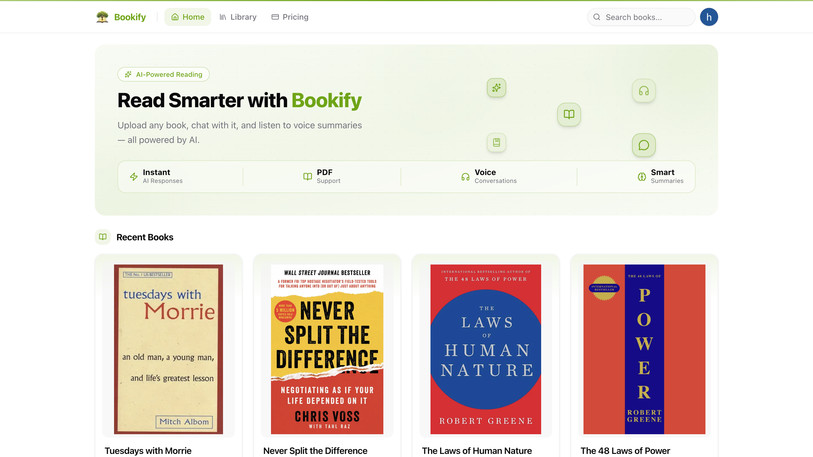
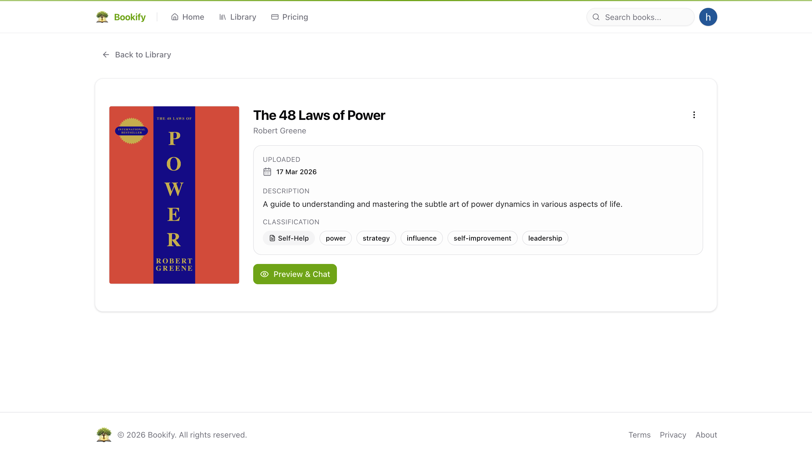
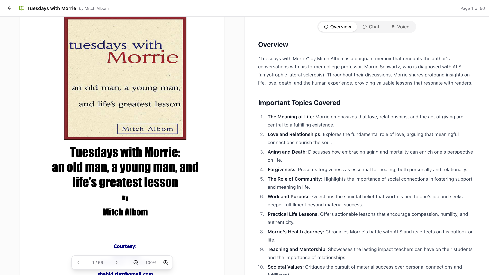
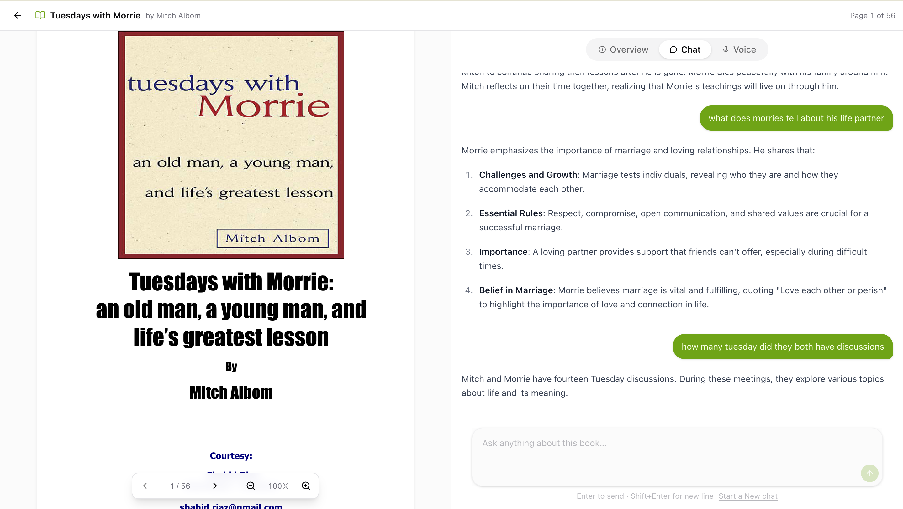
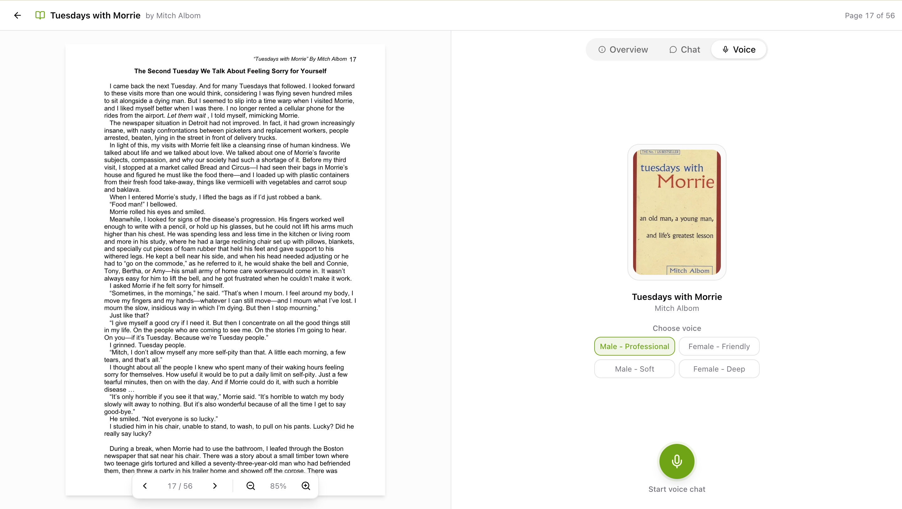

<div align="center">
  
  <h1>Bookify</h1>
  <p><strong>Read smarter.</strong> Upload any book, chat with it, and listen to voice summaries — all powered by AI.</p>

  <p>
    
    
    
    
  </p>
</div>

---

## What is Bookify?

Bookify is an AI-powered reading companion. Upload a PDF book and get:

- An **AI-generated overview** covering key themes and important topics
- A **chat interface** to ask questions about the book and get contextual answers
- A **voice conversation** mode where you can talk to the book out loud
- Smart **metadata extraction** — title, author, genre, and tags auto-filled from the PDF

---

## Screenshots

### Book Detail



### AI-Generated Overview



### Chat with Your Book



### Voice Conversations



---

## Features

| Feature | Description |
|---|---|
| **PDF Upload** | Upload books up to 50 MB; stored securely in AWS S3 |
| **AI Metadata** | Gemini auto-extracts title, author, description, genre, and tags |
| **Book Overview** | AI-generated summary with important topics, themes, and insights |
| **Chat (RAG)** | Ask anything about the book — answers grounded in the actual text via pgVector embeddings |
| **Voice Mode** | Choose a voice persona (Male Professional, Female Friendly, etc.) and have a spoken conversation about the book |
| **PDF Viewer** | Read the original PDF inline, side-by-side with the AI panel |
| **Library** | Browse and manage all your uploaded books |
| **Auth** | Secure sign-in and sign-up via Clerk |

---

## Tech Stack

**Frontend**
- [Next.js 16](https://nextjs.org/) (App Router) + React 19
- [Tailwind CSS 4](https://tailwindcss.com/) + [shadcn/ui](https://ui.shadcn.com/)
- [Framer Motion](https://www.framer.com/motion/) for animations
- [react-pdf](https://react-pdf.org/) for the inline PDF viewer

**Backend & AI**
- [MongoDB](https://www.mongodb.com/) — book metadata and chat history
- [NeonDB](https://neon.tech/) + pgVector — vector embeddings for RAG search
- [AWS S3](https://aws.amazon.com/s3/) — PDF and cover image storage
- [Google Gemini](https://ai.google.dev/) — metadata extraction, embeddings, and summaries
- [LangChain](https://www.langchain.com/) — AI orchestration and agent actions
- [Vapi](https://vapi.ai/) — real-time voice AI conversations
- [Inngest](https://www.inngest.com/) — background book processing pipeline

**Auth & Infra**
- [Clerk](https://clerk.com/) — authentication
- [Vercel Analytics](https://vercel.com/analytics)

---

## Getting Started

### Prerequisites

- Node.js 20+
- A MongoDB instance (local or Atlas)
- NeonDB project with pgVector enabled
- AWS S3 bucket
- Clerk application
- Google Gemini API key
- Vapi account
- Inngest account (or use the local dev server)

### Installation

```bash
git clone https://github.com/your-username/bookify.git
cd bookify
npm install
```

### Environment Variables

Copy `.env.example` to `.env.local` and fill in your credentials:

```bash
cp .env.example .env.local
```

| Variable | Description |
|---|---|
| `MONGODB_URI` | MongoDB connection string |
| `NEON_DATABASE_URL` | NeonDB connection string (with pgVector) |
| `NEXT_PUBLIC_CLERK_PUBLISHABLE_KEY` | Clerk publishable key |
| `CLERK_SECRET_KEY` | Clerk secret key |
| `GEMINI_API_KEY` | Google Gemini API key |
| `GEMINI_MODEL` | Gemini model name (e.g. `gemini-2.0-flash`) |
| `AWS_REGION` | S3 bucket region |
| `AWS_S3_BUCKET` | S3 bucket name |
| `AWS_ACCESS_KEY_ID` | AWS access key |
| `AWS_SECRET_ACCESS_KEY` | AWS secret key |
| `VAPI_API_KEY` | Vapi API key |
| `VAPI_VOICE_ID_MALE_PROFESSIONAL` | Vapi voice ID |
| `VAPI_VOICE_ID_FEMALE_FRIENDLY` | Vapi voice ID |
| `INNGEST_EVENT_KEY` | Inngest event key |
| `INNGEST_SIGNING_KEY` | Inngest signing key |

### Run Locally

```bash
npm run dev
```

App runs at [http://localhost:3001](http://localhost:3001).

For background book processing, start the Inngest dev server in a separate terminal:

```bash
npx inngest-cli@latest dev
```

---

## Project Structure

```
src/
├── app/
│   ├── (preview)/preview/[id]/   # Book reader — PDF viewer + AI panels
│   ├── (protected)/upload/        # Book upload flow
│   └── api/                       # API routes (books, chat, voice, users)
├── modules/
│   ├── agents/                    # AI agent actions (summary, embeddings)
│   ├── books/                     # Book model, schema, types
│   ├── chat/                      # Chat model
│   └── voice/                     # Voice model
├── lib/
│   ├── inngest/                   # Background processing pipeline
│   ├── vector-store.ts            # pgVector insert/search
│   ├── chunker.ts                 # PDF text chunking
│   └── api/                       # S3, Vapi, embeddings helpers
└── components/                    # Shared UI components
```

---

## Scripts

| Script | Description |
|---|---|
| `npm run dev` | Start dev server on port 3001 |
| `npm run build` | Production build |
| `npm run lint` | Lint with ESLint |
| `npm run type-check` | TypeScript type check |
| `npm run summaries:backfill` | Backfill AI summaries for existing books |

---

## License

MIT
